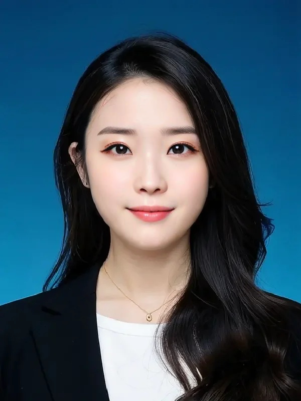
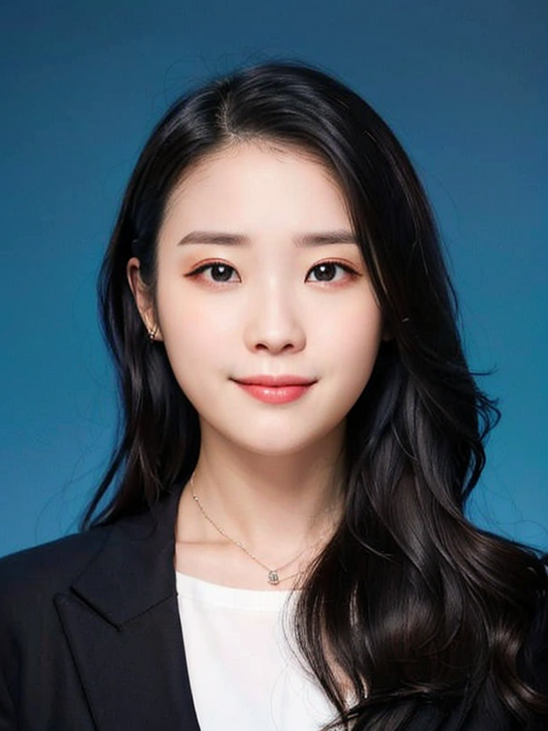
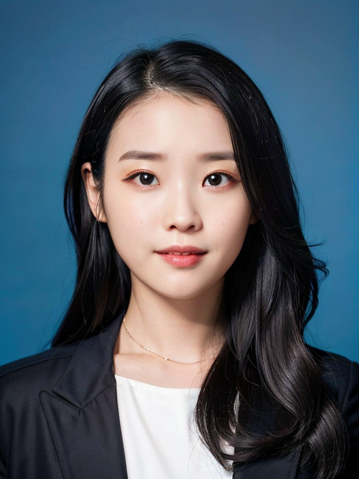
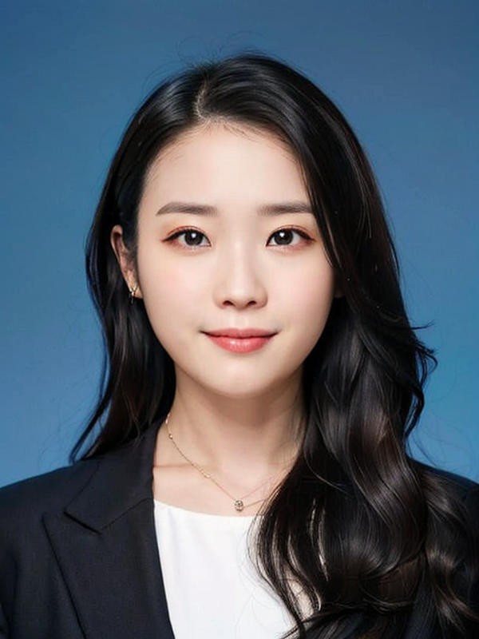
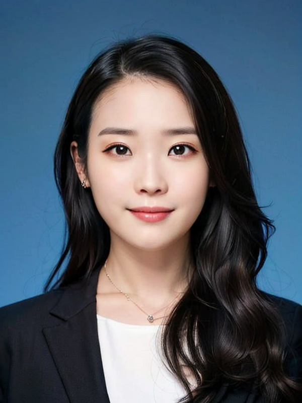

## miaoya_pipeline

复现妙鸭相机证件照生成的pipeline

结论： V2的效果最好，V3的速度最快，但是面临妆容和ID不够匹配的问题，如果能训练一个 天真蓝/海马体/古装照 半身lora作为基底模型，效果会更好

### V1 inpainting

Head/face inpainting based on sd-webui and lora models from civitai:

|          origin           |         face inpainting         | face&neck inpainting                     |
|:-------------------------:|:-------------------------------:|------------------------------------------|
|  |  |  | 

- using chilloutmix as base model (realistic asian women)
- using tagger(wd14) for prompts reverse
- using textual inversion negative prompts (ng_deepnegative_v1_75t,badhandv4)
- optim mask blur for cheek edge  >15
- DPM++SDE Karras sample step 30 for speed up
- controlnet reference 0.5
- controlnet softedge_pidinet 0.75
- controlnet openpose face 0.7

### V2 inpainting + img2img

Fix face color different from background, more realistic

| face&neck inpainting |          img2img depth           | img2img depth&softedge                   |
|:----:|:--------------------------------:|------------------------------------------|
|    |  | | 

- have tried more realistic/style/portrait lora(not shown here)
- 由于没有风格lora约束，人物lora会带入风格（假设该lora训练时拟合了五官以外信息）

### V3 faceswap + img2img

Only do one time img2img and can be faster.

| origin |          img2img           | faceswap + img2img                   |
|:----:|:--------------------------:|--------------------------------------|
|   |  |  | 

- using [inswapper](https://github.com/deepinsight/insightface/blob/master/python-package/insightface/model_zoo/inswapper.py) for faceswap
- private face swap model (not shown here)
- reference/softedge_pidinet/depth to control details

## supply materials

### lora training experience

using 20 upper body images to train a face lora model

20张半身像（参考妙鸭）稳定训练出一个比较好的lora还是有一点困难，目前一些tips：

- 产品逻辑上，参考妙鸭，四组参数训练四个模型供用户选择
- 有人在用证件照训练lora底模 [知乎](https://www.zhihu.com/question/613419782/answer/3133599555)
- 不做任何优化的前提下，20张图片A100大约20分钟收敛（batch4 不考虑显存和多路复用），还可以更快（降低rank等）
- 专注训练脸部lora（加入五官提示词）
- 一些更新的社区工作（Lion SDXL LyCORIS等等）,lora在同类型图片（半身像）上预训练后可能会提升效果/减少训练时间

### Support

- base model from [chilloutmix](https://civitai.com/models/6424)
- lora from on [iu](https://civitai.com/models/11722/iu)
- origin photo from 小红书

## TODO

- [ ] pipeline extract from sd-webui based on sd-api
- [ ] lora training deploy%speedup
- [ ] 妙鸭数据爬取和对应的lora风格训练